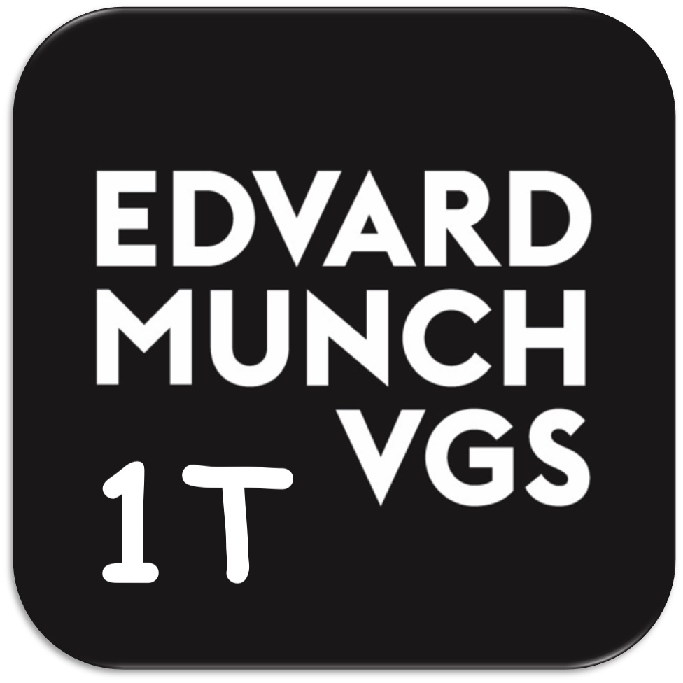

# Digital lærebok i matematikk 1T

 

Klikk på meg $\to$ 
$\gets$

 

<!-- 

-->

En digital lærebok i matematikk med interaktive oppgaver og aktiviteter, inkludert interaktive kodeproblemer og øvelser designet for å forbedre læring og designet rundt læreplanen for matematikk 1T. 

## Innholdsfortegnelse
1. [Oversikt](#oversikt)
2. [Funksjoner](#funksjoner)
3. [Komme i gang](#komme-i-gang)
4. [Bruk](#bruk)
5. [Bidra](#bidra)
6. [Lisenser](#lisenser)
7. [Takk](#takk)

## Oversikt

Dette prosjektet er en nettbasert lærebok i matematikk som inkluderer teori, oppgavesett og interaktive aktiviteter for å støtte læring. De interaktive kodeeksemplene og oppgavene er designet for å gi praktiske læringsopplevelser.

## Funksjoner

- Matematisk teori for matematikk 1T
- Blanding av oppgaver og interaktive aktiviteter
- Mulighet for å kjøre Pythonkode direkte på nettstedet
- Åpen kildekode som muliggjør bidrag og tilpasning til egen bruk
- Brukervennlig grensesnitt og støtte for interaktiv læring

## Lisenser

### Kildekode

Kildekoden til dette prosjektet er lisensiert under **GNU Affero General Public License (AGPL-3.0)**. Dette sikrer at alle avledede verk og modifikasjoner av kodebasen må forbli åpen kildekode. Du kan lese hele lisensen [her](https://www.gnu.org/licenses/agpl-3.0.en.html).

For mer informasjon, se [LICENSE](LICENSE)-filen i rotmappen til repositoriet.

### Innhold

Lærebokinnholdet, inkludert tekst, oppgaver og ikke-kode interaktive elementer, er lisensiert under **Creative Commons Attribution-NonCommercial-ShareAlike 4.0 International (CC BY-NC-SA 4.0)**. Denne lisensen tillater andre å dele, remikse og tilpasse innholdet så lenge de gir attribusjon, ikke bruker det til kommersielle formål, og deler videre under samme lisens. Du kan lese hele lisensen [her](https://creativecommons.org/licenses/by-nc-sa/4.0/legalcode).

For mer informasjon, se [LICENSE_CONTENT.md](LICENSE_CONTENT.md)-filen.

