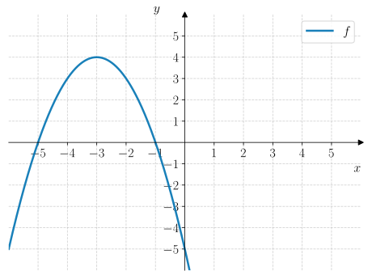
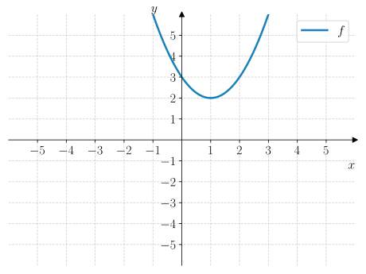
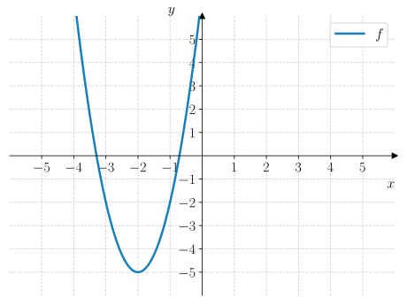
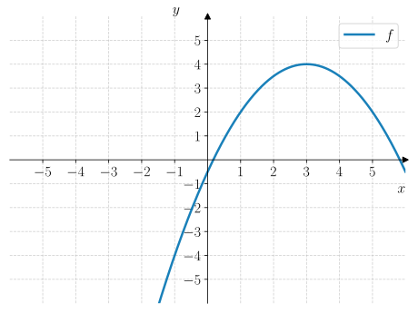

# Oppgaver: Ekstremalform

:::{quiz} Oppgave 1
Q: Hvilket funksjonsuttrykk hører til grafen? 
+ $$f(x) = -(x + 3)^2 + 4$$
- $$f(x) = -(x + 4)^2 + 3$$
- $$f(x) = (x + 3)^2 - 4$$
- $$f(x) = (x + 4)^2 - 3$$

Q: Hvilket funksjonsuttrykk hører til grafen? 
+ $$f(x) = (x - 1)^2 + 2$$
- $$f(x) = -(x - 1)^2 + 2$$
- $$f(x) = (x + 2)^2 - 1$$
- $$f(x) = -(x + 2)^2 + 1$$

Q: Hvilket funksjonsuttrykk hører til grafen? 
+ $$f(x) = 3(x + 2)^2 - 5$$
- $$f(x) = -2(x + 3)^2 - 5$$
- $$f(x) = 5(x - 2)^2 + 3$$
- $$f(x) = 3(x + 5)^2 - 2$$

Q: Hvilket funksjonsuttrykk hører til grafen? 
+ $$f(x) = -\dfrac{1}{2}(x - 3)^2 + 4$$
- $$f(x) = \dfrac{1}{2}(x - 3)^2 + 4$$
- $$f(x) = -(x + 3)^2 + 4$$
- $$f(x) = (x + 4)^2 + 3$$

Q: Symmetrilinja til $f(x) = -2(x - 1)^2 + 3$ er ...
+ $$x = 1$$
- $$x = -1$$
- $$x = 2$$
- $$x = 3$$

Q: Symmetrilinja til $f(x) = 3(x + 2)^2 - 4$ er ...
+ $$x = -2$$
- $$x = 2$$
- $$x = 4$$
- $$x = 3$$

Q: Ekstremalpunktet til $f(x) = -(x + 4)^2 - 2$ er ...
+ $$x = -4$$
- $$x = 4$$
- $$x = 2$$
- $$x = -2$$

Q: Ekstremalverdien til $f(x) = 4(x - 1)^2 + 3$ er ...
+ $$y = 3$$
- $$y = 4$$
- $$y = 1$$
- $$y = 2$$

:::

---

:::::::::::::::{admonition} Oppgave 2
---
class: problem-level-1
---
Grafen til en andregradsfunksjon $f$ er vist i {numref}`fig-andregradsfunksjoner-representasjoner-ekstremalform-oppgave-2`.

:::{figure} ./figurer/oppgaver/oppgave_2.svg
---
name: fig-andregradsfunksjoner-representasjoner-ekstremalform-oppgave-2
width: 80%
class: no-click, adaptive-figure
---
viser grafen til en andregradsfunksjon $f$.
:::

::::::::::::::{tab-set}
---
class: tabs-parts
---
:::::::::::::{tab-item} a
Bestem ekstremalpunktet til $f$.

:::{admonition} Fasit
---
class: dropdown, answer
---
$$
(-3, -4)
$$
:::
:::::::::::::

:::::::::::::{tab-item} b
Er ekstremalpunktet et toppunkt eller bunnpunkt?

:::{admonition} Fasit
---
class: dropdown, answer
---
Bunnpunkt.
:::
:::::::::::::

:::::::::::::{tab-item} c
Bestem ekstremalformen til $f(x)$. 

:::{admonition} Fasit
---
class: dropdown, answer
---
$$
f(x) = 2(x + 3)^2 - 4
$$
:::
:::::::::::::

::::::::::::::

:::::::::::::::

---

:::::::::::::::{admonition} Oppgave 3
---
class: problem-level-1
---
Grafen til en andregradsfunksjon $g$ er vist i {numref}`fig-andregradsfunksjoner-representasjoner-ekstremalform-oppgave-3`.

:::{figure} ./figurer/oppgaver/oppgave_3.svg
---
name: fig-andregradsfunksjoner-representasjoner-ekstremalform-oppgave-3
width: 80%
class: no-click, adaptive-figure
---
viser grafen til en andregradsfunksjon $g$.
:::

::::::::::::::{tab-set}
---
class: tabs-parts
---
:::::::::::::{tab-item} a
Bestem ekstremalpunktet til $g$. 

:::{admonition} Fasit
---
class: dropdown, answer
---
$$
(2, 1)
$$
:::
:::::::::::::

:::::::::::::{tab-item} b
Er ekstremalpunktet et toppunkt eller bunnpunkt?

:::{admonition} Fasit
---
class: dropdown, answer
---
Toppunkt.
:::
:::::::::::::

:::::::::::::{tab-item} c
Bestem ekstremalformen til $g(x)$. 

:::{admonition} Fasit
---
class: dropdown, answer
---
$$
g(x) = -(x - 2)^2 + 1
$$
:::
:::::::::::::

::::::::::::::
:::::::::::::::

---

:::::::::::::::{admonition} Oppgave 4
---
class: problem-level-1
---
::::::::::::::{tab-set}
---
class: tabs-parts
---
:::::::::::::{tab-item} a
Ekstremalformen til en andregradsfunksjon er gitt ved 

$$
f(x) = 3(x - 2)^2 + 5.
$$

Bestem standardformen til $f(x)$. 

:::{admonition} Fasit
---
class: dropdown, answer
---
$$
f(x) = 3x^2 - 12x + 17
$$
:::
:::::::::::::

:::::::::::::{tab-item} b
Ekstremalformen til en andregradsfunksjon er gitt ved 

$$
g(x) = -2(x + 1)^2 - 3
$$

Bestem standardformen til $g(x)$. 

:::{admonition} Fasit
---
class: dropdown, answer
---
$$
f(x) = -2x^2 - 4x - 5
$$
:::
:::::::::::::

:::::::::::::{tab-item} c
Ekstremalformen til en andregradsfunksjon er gitt ved 

$$
h(x) = 4(x - 3)^2 - 7
$$

Bestem standardformen til $h(x)$. 

:::{admonition} Fasit
---
class: dropdown, answer
---
$$
h(x) = 4x^2 - 24x + 29
$$
:::
:::::::::::::

:::::::::::::{tab-item} d
Ekstremalformen til en andregradsfunksjon er gitt ved 

$$
r(x) = -5(x + 1)^2 + 6
$$

Bestem standardformen til $r(x)$. 

:::{admonition} Fasit
---
class: dropdown, answer
---
$$
r(x) = -5x^2 - 10x + 1
$$
:::
:::::::::::::

::::::::::::::

:::::::::::::::

---

:::::::::::::::{admonition} Oppgave 5
---
class: problem-level-1
---
En andregradsfunksjon $f$ har nullpunktsformen

$$
f(x) = -(x - 2)(x + 4).
$$

::::::::::::::{tab-set}
---
class: tabs-parts
---
:::::::::::::{tab-item} a
Bestem {popup}`symmetrilinja til $f$.<Hvis nullpunktene til $f$ er $x_1$ og $x_2$, så vil symmetrilinja $x_0$ være gjennomsnittet av de to punktene: $$x_0 = \dfrac{x_1 + x_2}{2}$$>`

:::{admonition} Fasit
---
class: dropdown, answer
---
$$
x = 1
$$
:::
:::::::::::::

:::::::::::::{tab-item} b
Avgjør om ekstremalpunktet til $f$ svarer til et toppunkt eller bunnpunkt.
:::{admonition} Fasit
---
class: dropdown, answer
---
Toppunkt siden $a < 0$.
:::
:::::::::::::
::::::::::::::

:::::::::::::::

---

:::::::::::::::{admonition} Oppgave 6
---
class: problem-level-1
---
En andregradsfunksjon $f$ har nullpunktsformen

$$
f(x) = 2(x + 1)(x + 3)
$$

::::::::::::::{tab-set}
---
class: tabs-parts
---
:::::::::::::{tab-item} a
Bestem symmetrilinja til $f$.

:::{admonition} Fasit
---
class: dropdown, answer
---
$$
x = -2
$$
:::
:::::::::::::

:::::::::::::{tab-item} b
Avgjør om ekstremalpunktet til $f$ er et toppunkt eller bunnpunkt.
:::{admonition} Fasit
---
class: dropdown, answer
---
Bunnpunkt siden $a > 0$.
:::
:::::::::::::
::::::::::::::

:::::::::::::::

---

:::::::::::::::{admonition} Oppgave 7
---
class: problem-level-2
---

::::::::::::::{tab-set}
---
class: tabs-parts
---

:::::::::::::{tab-item} a
Nullpunktsformen til en andregradsfunksjon $f$ er gitt ved

$$
f(x) = 2(x - 1)(x + 3).
$$

Bestem ekstremalformen til $f(x)$. 

:::{admonition} Fasit
---
class: dropdown, answer
---
$$
f(x) = 2(x + 1)^2 - 8
$$
:::
:::::::::::::

:::::::::::::{tab-item} b
Nullpunktsformen til en andregradsfunksjon $g$ er gitt ved

$$
g(x) = -(x + 2)(x - 4).
$$

Bestem ekstremalformen til $g(x)$.

:::{admonition} Fasit
---
class: dropdown, answer
---
$$
g(x) = -(x - 1)^2 + 9
$$
:::
:::::::::::::

:::::::::::::{tab-item} c
Nullpunktsformen til en andregradsfunksjon $h$ er gitt ved

$$
h(x) = 3(x - 1)(x - 5).
$$

Bestem ekstremalformen til $h(x)$.

:::{admonition} Fasit
---
class: dropdown, answer
---
$$
h(x) = 3(x - 3)^2 - 12
$$
:::
:::::::::::::

:::::::::::::{tab-item} d
Nullpunktsformen til en andregradsfunksjon $r$ er gitt ved

$$
r(x) = -\dfrac{1}{2}(x - 2)(x + 6).
$$

Bestem ekstremalformen til $r(x)$.

:::{admonition} Fasit
---
class: dropdown, answer
---
$$
r(x) = -\drac{1}{2}(x + 2)^2 - 8
$$
:::
:::::::::::::

::::::::::::::

:::::::::::::::

---

:::::::::::::::{admonition} Oppgave 8
---
class: problem-level-2
---

::::::::::::::{tab-set}
---
class: tabs-parts
---
:::::::::::::{tab-item} a
En andregradsfunksjon $f$ har et ekstremalpunkt i $(1, 3)$ og skjærer $y$-aksen i $(0, 2)$. 

Bestem ekstremalformen til $f(x)$.

:::{admonition} Fasit
---
class: dropdown, answer
---
$$
f(x) = -(x - 1)^2 + 3
$$
:::
:::::::::::::

:::::::::::::{tab-item} b
En andregradsfunksjon $g$ har
* Symmetrilinje $x = 2$.
* Skjæring med $y$-aksen i $y = 4$. 
* Verdimengden $g(x) \in \langle \gets, 5]$.

Bestem ekstremalformen til $g(x)$.

:::{admonition} Fasit
---
class: dropdown, answer
---
$$
g(x) = -\dfrac{1}{4}(x - 1)^2 + 5
$$
:::
:::::::::::::

:::::::::::::{tab-item} c
En andregradsfunksjon $h$ har
* Symmetrilinja $x = -2$.
* Verdimengden $h(x) \in [1, \to \rangle$.
* Skjæringspunkt med $y$-aksen i $(0, 5)$.

Bestem ekstremalformen til $h(x)$. 

:::{admonition} Fasit
---
class: dropdown, answer
---
$$
h(x) = (x + 2)^2 + 1
$$
:::
:::::::::::::

::::::::::::::
:::::::::::::::