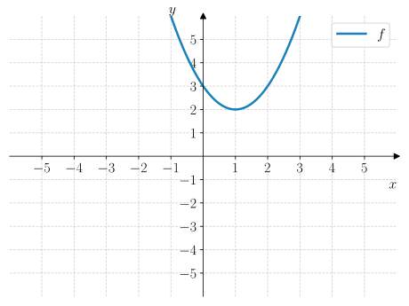
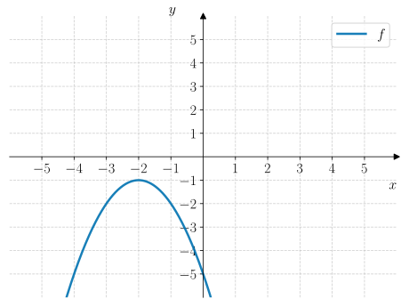
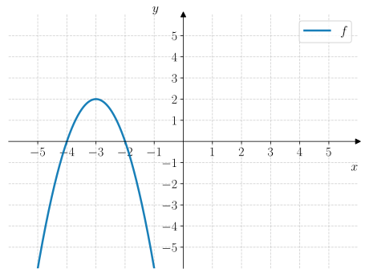

# Ekstremalform

:::{admonition} Læringsmål
---
class: tip
---
* Kunne representere en andregradsfunksjon på ekstremalform, og lese av ekstremalpunktet fra funksjonsuttrykket.
* Kunne bestemme $f(x)$ på ekstremalform fra graf. 
* Kunne finne standardform fra ekstremalform.
* Kunne finne ekstremalform fra nullpunktsform, og kunne beskrive sammenhengen mellom nullpunkter og symmetrilinje.
* Kunne bestemme om et ekstremalpunkt er et topp- eller bunnpunkt fra ekstremalformen til en andregradsfunksjon.
::: 

Før vi ser på hva ekstremalformen til en andregradsfunksjon er, må vi først definere noen nye begreper. 

:::::::::::::::{admonition} Ekstremalpunkt, ekstremalverdi, toppunkt og bunnpunkt
---
class: theory
---
En andregradsfunksjon har enten et **toppunkt** og **bunnpunkt**.   Vi kaller $x$-koordinaten til dette punktet for **ekstremalpunktet** og $y$-koordinaten for **ekstremalverdien**.

Se figuren nedenfor.

:::{clickable-figure} ./figurer/teori/merged_figure.svg
---
width: 100%
---
viser to andregradsfunksjoner der grafen til venstre har et bunnpunkt og grafen til høyre har et toppunkt.
:::

:::::::::::::::

---

:::::::::::::::::{admonition} Eksempel 1
---
class: example
---

Grafen til en andregradsfunksjon $f$ er vist i {numref}`fig-andregradsfunksjoner-representasjoner-ekstremalform-eksempel-1`.

1. Bestem hva slags ekstremalpunkt $f$ har.
2. Bestem ekstremalpunktet og ekstremalverdien til $f$.

:::{figure} ./figurer/eksempler/eksempel_1.svg
---
name: fig-andregradsfunksjoner-representasjoner-ekstremalform-eksempel-1
width: 80%
class: no-click, adaptive-figure
---
viser grafen til en andregradsfunksjon $f$.
:::

:::{admonition} Løsning
---
class: solution
---
1. Siden grafen til $f$ er *konkav* $\frown$, har $f$ et toppunkt.
2. Det høyeste punktet på grafen er $(-1, 2)$. Dette er koordinatene til toppunktet på grafen til $f$. Da er $x_0 = -1$ ekstremalpunktet og $y_0 = 2$ ekstremalverdien.
:::

:::::::::::::::::

---

## Ekstremalform: algebraisk og grafisk

Ekstremalformen til en andregradsfunksjon er en tredje måte å skrive en andregradsfunksjon på. Ekstremalformen inneholder informasjon om ekstremalpunktet til funksjonen.

:::::{admonition} Ekstremalform
---
class: theory
---
Ekstremalformen til en andregradsfunksjon $f$ er gitt ved

:::{figure} ./figurer/teori/algebraisk_uttrykk.svg
---
width: 80%
class: no-click, adaptive-figure
---
:::

* Hvis $a > 0$ er grafen til $f$ konveks $\smile$ og har et bunnpunkt.
* Hvis $a < 0$ er grafen til $f$ konkav $\frown$ og har et toppunkt.
* Linja $x = x_0$ er symmetrilinja til $f$. Grafen er speilet rundt denne linja!

:::{figure} ./figurer/teori/grafisk_representasjon.svg
---
width: 80%
class: no-click, adaptive-figure
---
:::

:::::

---

:::::::::::::::{admonition} Eksempel 2
---
class: example
---
Under vises noen eksempler på andregradsfunksjoner med grafen og tilhørende funksjonsuttrykk skrevet på ekstremalform. 

::::::::::::::{tab-set}
---
class: tabs-parts
---
:::::::::::::{tab-item} $f$
Grafen til $f$ har et bunnpunkt i $(-1, -3)$ som betyr at grafen til $f$ har
* ekstremalpunktet $x_0 = -1$
* ekstremalverdien $y_0 = -3$.

Ekstremalformen til $f(x)$ er gitt ved

$$
f(x) = (x + 1)^2 - 3
$$

:::{figure} ./figurer/eksempler/eksempel_2/f.svg
---
width: 80%
class: no-click, adaptive-figure
---
:::

:::::::::::::

:::::::::::::{tab-item} $g$
Grafen til $g$ har et toppunkt i $(2, 1)$ som betyr at $g$ har
* ekstremalpunktet $x_0 = 2$
* ekstremalverdien $y_0 = 1$.

Ekstremalformen til $g(x)$ er gitt ved 

$$
g(x) = -\dfrac{1}{2}(x - 2)^2 + 1
$$

:::{figure} ./figurer/eksempler/eksempel_2/g.svg
---
width: 80%
class: no-click, adaptive-figure
---
:::

:::::::::::::

:::::::::::::{tab-item} $h$
Grafen til $h$ har et bunnpunkt i $(-1, 1)$ som betyr at $h$ har
* ekstremalpunktet $x_0 = -1$
* ekstremalverdien $y_0 = 1$.

Ekstremalformen til $h(x)$ er gitt ved

$$
h(x) = 2(x + 1)^2 + 1
$$

:::{figure} ./figurer/eksempler/eksempel_2/h.svg
---
width: 80%
class: no-click, adaptive-figure
---
:::

:::::::::::::

::::::::::::::

:::::::::::::::

---

:::{quiz} Quiz 1
Q: Hvilket funksjonsuttrykk hører til grafen? 
+ $$f(x) = (x - 1)^2 + 2$$
- $$f(x) = (x + 1)^2 + 2$$
- $$f(x) = (x - 1)^2 - 2$$
- $$f(x) = (x + 1)^2 - 2$$

Q: Symmetrilinja til $f$ er ... 
+ $$x = 1$$
- $$x = 2$$
- $$x = -1$$
- $$x = -2$$

Q: Hvilket funksjonsuttrykk hører til grafen? 
+ $$f(x) = -(x + 2)^2 - 1$$
- $$f(x) = -(x - 2)^2 - 1$$
- $$f(x) = (x + 2)^2 - 1$$
- $$f(x) = (x + 2)^2 + 1$$

Q: Symmetrilinja til $f$ er ... 
+ $$x = -2$$
- $$x = 2$
- $$x = 1$$
- $$x = -1$$

Q: Hvilket funksjonsuttrykk hører til grafen? 
+ $$f(x) = -2(x + 3)^2 + 2$$
- $$f(x) = -2(x - 3)^2 + 2$$
- $$f(x) = -2(x + 2)^2 + 3$$
- $$f(x) = 2(x + 3)^2 + 2$$

Q: Symmetrilinja til $f(x) = 3(x + 2)^2 - 4$ er ...
+ $$x = -2$$
- $$x = 2$$
- $$x = 3$$
- $$x = -4$$

Q: Symmetrilinja til $f(x) = -2(x + 2)^2 - 1$ er ...
+ $$x = -2$$
- $$x = 2$$
- $$x = 1$$
- $$x = -1$$
:::

---

## Bestemme $f(x)$ fra graf

Vi skal se på hvordan vi kan gå fra grafen til en andregradsfunksjon til et funksjonsuttrykk for ved hjelp av ekstremalformen. 

:::::::::::::::{admonition} Eksempel 3
---
class: example
---
Grafen til en andregradsfunksjon er vist i {numref}`fig-andregradsfunksjoner-representasjoner-ekstremalform-eksempel-3`.

Bestem ekstremalformen til $f(x)$.

:::{figure} ./figurer/eksempler/eksempel_3.svg
---
name: fig-andregradsfunksjoner-representasjoner-ekstremalform-eksempel-3
width: 80%
class: no-click, adaptive-figure
---
viser grafen til en andregradsfunksjon $f$.
:::  

::::{admonition} Løsning
---
class: solution
---
Vi starter fra ekstremalformen til $f(x)$:

$$
f(x) = a(x - x_1)^2 + y_1
$$

Fra grafen til $f$ kan vi lese av at det har et bunnpunkt i $(1, -2)$ som betyr at 

$$
(x_1, y_1) = (1, -2).
$$

Vi setter dette inn i ekstremalformen til $f$:

$$
f(x) = a(x - 1)^2 - 2
$$

Nå må vi ha ett punkt til for å bestemme $a$. Vi kan se at grafen går gjennom punkt $(3, 0)$ som betyr at 

\begin{align*}
    f(3) &= 0 \\
    \\
    a(3 - 1)^2 - 2 &= 0 \\
    \\
    4a - 2 &= 0 \\
    \\
    4a &= 2 \\
    \\
    a &= \dfrac{1}{2}
\end{align*}

Dermed er 

$$
f(x) = \dfrac{1}{2}(x - 1)^2 - 2
$$
::::

:::::::::::::::

---

:::::::::::::::{admonition} Underveisoppgave 1
---
class: check
---
Grafen til en andregradsfunksjon $f$ er vist i {numref}`fig-andregradsfunksjoner-representasjoner-ekstremalform-underveisoppgave-2`.

Bestem ekstremalformen til $f(x)$.

:::{figure} ./figurer/underveisoppgaver/underveisoppgave_2.svg 
---
name: fig-andregradsfunksjoner-representasjoner-ekstremalform-underveisoppgave-2
width: 80%
class: no-click, adaptive-figure
---
viser grafen til en andregradsfunksjon $f$.
:::

:::{admonition} Fasit
---
class: dropdown, answer
---
$$
f(x) = -3(x + 2)^2 + 4
$$
:::

:::{admonition} Løsning
---
class: dropdown, solution
---
Vi starter fra ekstremalformen til $f(x)$:

$$
f(x) = a(x - x_1)^2 + y_1
$$

Vi kan lese fra grafen til $f$ at det har et toppunkt i $(-2, 4)$ som betyr at

$$
f(x) = a(x - (-2))^2 + 4 = a(x + 2)^2 + 4
$$

Vi trenger ett punkt til for å bestemme $a$. Vi kan se at grafen går gjennom punkt $(-1, 1)$ som gir 

\begin{align*}
    f(-1) &= 1 \\
    \\
    a(-1 + 2)^2 + 4 &= 1 \\
    \\
    a(1)^2 + 4 &= 1 \\
    \\
    a + 4 &= 1 \\
    \\
    a &= -3
\end{align*}

Dermed er 

$$
f(x) = -3(x + 2)^2 + 4
$$
:::

:::::::::::::::

## Fra nullpunktsform til ekstremalform

Vi skal nå se på hvordan vi kan gå fra nullpunktsformen til ekstremalformen til en andregradsfunksjon. 

:::::::::::::::{admonition} Utforsk 1
---
class: explore
---
Her skal du utforske sammenhengen mellom nullpunktsformen og ekstremalformen til en andregradsfunksjon.

::::::::::::::{tab-set}
---
class: tabs-parts
---
:::::::::::::{tab-item} a
Se på grafene under. 

1. Kan du se en sammenheng om hvor nullpunktene ligger i forhold til symmetrilinja? 
2. Kan du beskrive sammenhengen generelt? 

:::{solution}
1. Det er like lang avstand fra symmetrilinja til hvert nullpunkt på $x$-aksen.
2. Symmetrilinja ligger **midt** mellom nullpunktene.
:::

::::::::::::{tab-set}
:::::::::::{tab-item} Graf A
:::{figure} ./figurer/utforsk/utforsk_1/a/a.svg
---
width: 80%
class: no-click, adaptive-figure
---
:::
:::::::::::

:::::::::::{tab-item} Graf B
:::{figure} ./figurer/utforsk/utforsk_1/a/b.svg
---
width: 80%
class: no-click, adaptive-figure
---
:::
:::::::::::

:::::::::::{tab-item} Graf C
:::{figure} ./figurer/utforsk/utforsk_1/a/c.svg
---
width: 80%
class: no-click, adaptive-figure
---
:::
:::::::::::
::::::::::::

:::::::::::::

:::::::::::::{tab-item} b
Bruk det at avstanden fra symmetrilinja til $x_0$ er den samme til hvert nullpunkt $x_1$ og $x_2$ til å finne en formel for $x_0$ uttrykt ved nullpunktene $x_1$ og $x_2$.

::::{answer}
$$
x_0 = \dfrac{x_1 + x_2}{2}
$$
::::

::::{solution}
Vi lar $x_1$ være det minste nullpunktet og $x_2$ være det største nullpunktet. Vi vet at symmetrilinja $x_0$ ligger mellom de to punktene som betyr at 

$$
x_1 < x_0 < x_2
$$

Samtidig kan vi konkludere at 
* $x_0 - x_1$ er avstanden fra $x_0$ til $x_1$ siden $x_0 > x_1$
* $x_2 - x_0$ er avstanden fra $x_0$ til $x_2$ siden $x_2 > x_0$

Siden de to avstandene skal være like, følger det at 

$$
x_0 - x_1 = x_2 - x_0
$$

Vi løser likningen med hensyn på $x_0$:

\begin{align*}
    x_0 - x_1 &= x_2 - x_0 \\
    \\
    2x_0 &= x_1 + x_2 \\
    \\
    x_0 &= \dfrac{x_1 + x_2}{2}
\end{align*}

Dermed finner vi at symmetrilinja $x_0$ er gjennomsnittet av nullpunktene.
::::

:::::::::::::

::::::::::::::

:::::::::::::::

---

:::::::::::::::{admonition} Sammenheng mellom nullpunkter og symmetrilinje
---
class: theory
---
Symmetrilinja $x_0$ er gjennomsnitt av nullpunktene $x_1$ og $x_2$, som vi kan regne ut med:

:::{figure} ./figurer/teori/nullpunkter_og_symmetrilinje.svg
---
width: 40%
class: no-click, adaptive-figure
---
:::

:::::::::::::::

---

:::::::::::::::{admonition} Underveisoppgave 2
---
class: check
---
Nullpunktsformen til en andregradsfunksjon er gitt ved

$$
f(x) = -2(x - 1)(x + 3)
$$

Bestem ekstremalformen til $f(x)$. 

::::::::::::::{admonition} Fasit
---
class: answer, dropdown
---

$$
f(x) = -2(x + 1)^2 - 8
$$

::::::::::::::

::::::::::::::{admonition} Løsning
---
class: solution, dropdown
---
Nullpunktene til $f(x)$ er 

$$
x = 1 \quad \lor \quad x = -3
$$

Symmetrilinja er gjennomsnittet av nullpunktene som gir 

$$
x_0 = \dfrac{1 + (-3)}{2} = \dfrac{-2}{2} = -1.
$$

$y$-koordinaten til ekstremalpunktet er

$$
y_0 = f(x_0) = f(-1) = -2\cdot (-1 - 1) \cdot (-1 + 3) = -2\cdot (-2)\cdot (2) = -8.
$$

Dermed er ekstremalformen til $f(x)$ gitt ved

$$
f(x) = -2(x + 1)^2 - 8
$$
::::::::::::::
:::::::::::::::

## Fra ekstremalform til standardform

Vi skal nå se på hvordan vi kan gå fra ekstremalformen til standardformen til en andregradsfunksjon.

::::{admonition} Eksempel 4
---
class: example
---
En andregradsfunksjon er gitt ved 

$$
f(x) = (x - 1)^2 + 3
$$

Bestem standardformen til $f(x)$. 

:::{admonition} Hint: Algebraisk lov 1
---
class: hints, dropdown
---
Vi bruker den algebraiske loven for multiplikasjon av to parenteser i utregningen under:

$$
(a + b)^2 = (a + b)(a + b)
$$
:::

:::{admonition} Hint: Algebraisk lov 2
---
class: hints, dropdown
---
Vi bruker den algebraiske loven for multiplikasjon av to parenteser i utregningen under:

$$
(a + b)(c + d) = ac + ad + bc + bd
$$
:::

:::{admonition} Løsning
---
class: solution
---
\begin{align*}
f(x) &= (x - 1)^2 + 3 \\
\\
&= \textcolor{red}{(x - 1)(x - 1)} + 3 \\
\\ 
&= \textcolor{red}{x^2 - x - x + (-1)\cdot (-1)} + 3 \\
\\
&= x^2 - 2x + 1 + 3 \\
\\
&= x^2 - 2x + 4
\end{align*}

Dermed er standardformen til $f(x)$ gitt ved 

$$
f(x) = x^2 - 2x + 4
$$
:::
::::

---

::::{admonition} Underveisoppgave 3
---
class: check
---
Bestem standardformen til 

$$
f(x) = (x + 3)^2 + 4.
$$

:::{admonition} Fasit
---
class: dropdown, answer
---
$$
f(x) = x^2 + 6x + 13
$$
:::

:::{admonition} Løsning
---
class: dropdown, solution
---
\begin{align*}
    f(x) &= (x + 3)^2 + 4 \\
    \\
    &= \textcolor{red}{(x + 3)(x + 3)} + 4 \\
    \\
    &= \textcolor{red}{x^2 + 3x + 3x + 3^2} + 4 \\
    \\
    &= \textcolor{red}{x^2 + 6x + 9} + 4 \\
    \\
    &= x^2 + 6x + 13
\end{align*}

Dermed er standardformen til $f(x)$ gitt ved 

$$
f(x) = x^2 + 6x + 13
$$
:::

::::

