# Oppgaver: Andregradsulikheter

:::::::::::::::{exercise} Oppgave 1
---
level: 1
---
::::::::::::::{tab-set}
---
class: tabs-parts
---
:::::::::::::{tab-item} a
Nedenfor vises grafen til en andregradsfunksjon $f$. 

Løs ulikheten 

$$
f(x) \leq 0.
$$

:::{figure} ./figurer/oppgaver/oppgave_1/a.svg
---
class: no-click, adaptive-figure
width: 90%
---
:::

::::{answer}
$$
x \in [-3, 1].
$$
::::

::::{solution}
Grafen til $f$ skjærer $x$-aksen i $(-3, 0)$ og $(1, 0)$. Grafen ligger under $x$-aksen mellom disse to punktene som betyr at $f(x) \leq 0$ når 

$$
x \in [-3, 1].
$$
::::

:::::::::::::

:::::::::::::{tab-item} b
Nedenfor vises grafen til en andregradsfunksjon $f$. 

Løs ulikheten 

$$
f(x) < 0.
$$

:::{figure} ./figurer/oppgaver/oppgave_1/b.svg
---
class: no-click, adaptive-figure
width: 90%
---
:::

::::{answer}
$$
x \in \langle \gets, -1 \rangle \cup \langle 3, \to \rangle.
$$
::::

::::{solution}
Grafen til $f$ skjærer $x$-aksen i $(-1, 0)$ og $(3, 0)$. På nedsiden av $(-1, 0)$ og på oversiden av $(3, 0)$ ligger grafen til $f$ under $x$-aksen som betyr at $f(x) < 0$ når

$$
x \in \langle \gets, -1 \rangle \cup \langle 3, \to \rangle.
$$
::::

:::::::::::::

:::::::::::::{tab-item} c
Nedenfor vises grafen til en andregradsfunksjon $f$. 

Løs ulikheten 

$$
f(x) > 0.
$$

:::{figure} ./figurer/oppgaver/oppgave_1/c.svg
---
class: no-click, adaptive-figure
width: 90%
---
:::

::::{answer}
$$
x \in \langle -5, 1 \rangle.
$$
::::

::::{solution}
Grafen til $f$ skjærer $x$-aksen i $(-5, 0)$ og $(1, 0)$. Mellom disse to punktene ligger grafen til $f$ over $x$-aksen som betyr at $f(x) > 0$ når

$$
x \in \langle -5, 1 \rangle.
$$
::::

:::::::::::::

:::::::::::::{tab-item} d
Nedenfor vises grafen til en andregradsfunksjon $f$. 

Løs ulikheten 

$$
f(x) \geq 0.
$$

:::{figure} ./figurer/oppgaver/oppgave_1/d.svg
---
class: no-click, adaptive-figure
width: 90%
---
:::

::::{answer}
$$
x \in \langle\gets, -2] \cup [2, \to \rangle.
$$
::::

::::{solution}
Grafen til $f$ skjærer $x$-aksen i $(-2, 0)$ og $(2, 0)$. På nedsiden av $(-2, 0)$ og på oversiden av $(2, 0)$ ligger grafen til $f$ over $x$-aksen som betyr at $f(x) \geq 0$ når

$$
x \in \langle\gets, -2] \cup [2, \to \rangle.
$$
::::

:::::::::::::

::::::::::::::
:::::::::::::::

---

:::::::::::::::{exercise} Oppgave 2
---
level: 1
---
Ta quizen!

:::{quiz} 
Q: Hvilken av fortegnslinjene hører til grafen? 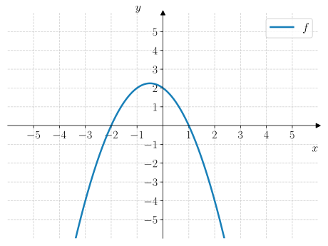
+ 
- 
- 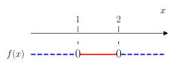
- 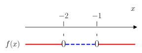

Q: Hvilken av fortegnslinjene hører til grafen? 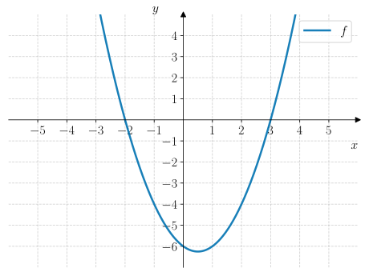
+ 
- 
- 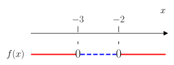
- 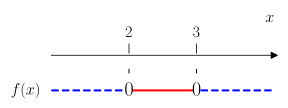

Q: Hvilken av fortegnslinjene hører til grafen? 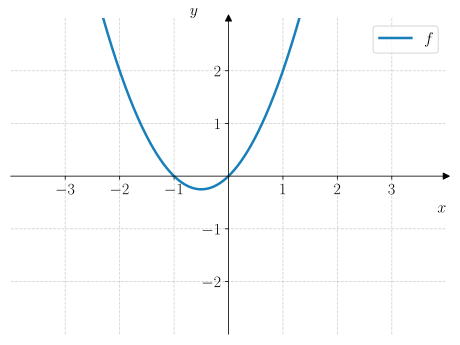
+ 
- 
- 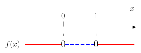
- 

Q: Hvilken av fortegnslinjene hører til grafen? 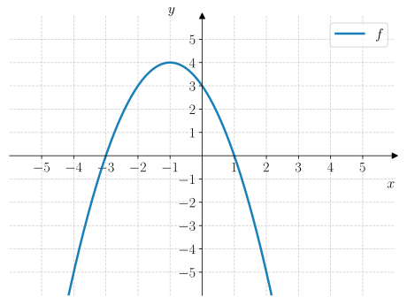
+ 
- 
- 
- 

Q: Hvilken av fortegnslinjene hører til grafen? 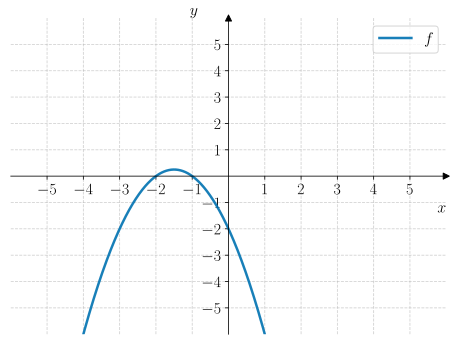
+ 
- 
- 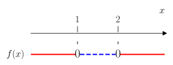
- 

:::

:::::::::::::::

---

:::::::::::::::{exercise} Oppgave 3
---
level: 1
---
::::::::::::::{tab-set}
---
class: tabs-parts
---
:::::::::::::{tab-item} a
En andregradsfunksjon $f$ har fortegnslinja:

:::{figure} ./figurer/oppgaver/oppgave_3/a/fortegnslinje.svg
---
class: no-click, adaptive-figure
width: 90%
---
:::

Avgjør hvilken av grafene nedenfor som viser grafen til $f$.

:::{figure} ./figurer/oppgaver/oppgave_3/a/merged_figure.svg
---
class: no-click, adaptive-figure
width: 100%
---
:::

::::{answer}
Graf C.
::::

:::::::::::::

:::::::::::::{tab-item} b
En andregradsfunksjon $g$ har fortegnslinja:

:::{figure} ./figurer/oppgaver/oppgave_3/b/fortegnslinje.svg
---
class: no-click, adaptive-figure
width: 90%
---
:::

Avgjør hvilken av grafene nedenfor som viser grafen til $g$.

:::{figure} ./figurer/oppgaver/oppgave_3/b/merged_figure.svg
---
class: no-click, adaptive-figure
width: 100%
---
:::

::::{answer}
Graf A. 
::::

:::::::::::::

:::::::::::::{tab-item} c
En andregradsfunksjon $h$ har fortegnslinja:

:::{figure} ./figurer/oppgaver/oppgave_3/c/fortegnslinje.svg
---
class: no-click, adaptive-figure
width: 90%
---
:::

Avgjør hvilken av grafene nedenfor som viser grafen til $h$.

:::{figure} ./figurer/oppgaver/oppgave_3/c/merged_figure.svg
---
class: no-click, adaptive-figure
width: 100%
---
:::

::::{answer}
Graf D. 
::::

:::::::::::::

::::::::::::::

:::::::::::::::

---

:::::::::::::::{exercise} Oppgave 4
---
level: 1
---
::::::::::::::{tab-set}
---
class: tabs-parts
---
:::::::::::::{tab-item} a
Nedenfor vises fortegnslinja til en andregradsfunksjon $f$.

Løs ulikheten 

$$
f(x) \geq 0.
$$

:::{figure} ./figurer/oppgaver/oppgave_4/a.svg
---
class: no-click, adaptive-figure
width: 90%
---
:::

::::{answer}
$$
x \in \langle \gets, -2] \cup [2, \to \rangle
$$
::::

:::::::::::::

:::::::::::::{tab-item} b
Nedenfor vises fortegnslinja til en andregradsfunksjon $g$.

Løs ulikheten 

$$
g(x) > 0.
$$

:::{figure} ./figurer/oppgaver/oppgave_4/b.svg
---
class: no-click, adaptive-figure
width: 90%
---
:::

::::{answer}
$$
x \in \langle -1, 2 \rangle
$$
::::

:::::::::::::

:::::::::::::{tab-item} c
Nedenfor vises fortegnslinja til en andregradsfunksjon $h$.

Løs ulikheten 

$$
h(x) < 0.
$$

:::{figure} ./figurer/oppgaver/oppgave_4/c.svg
---
class: no-click, adaptive-figure
width: 90%
---
:::

::::{answer}
$$
x \in \langle \gets, -2 \rangle \cup \langle -2, \to \rangle
$$
::::

:::::::::::::

:::::::::::::{tab-item} d
Nedenfor vises fortegnslinja til en andregradsfunksjon $p$.

Løs ulikheten 

$$
p(x) \leq 0.
$$

:::{figure} ./figurer/oppgaver/oppgave_4/d.svg
---
class: no-click, adaptive-figure
width: 90%
---
:::

::::{answer}
$$
x \in \langle \gets, -1] \cup [0,  \to \rangle
$$
::::

:::::::::::::

::::::::::::::
:::::::::::::::

---

:::::::::::::::{exercise} Oppgave 5
---
level: 1
---
::::::::::::::{tab-set}
---
class: tabs-parts
---
:::::::::::::{tab-item} a
Løs ulikheten

$$
(x + 2)(x - 4) \leq 0
$$

::::{answer}
$$
x \in [-2, 4]
$$
::::

::::{solution}
Vi tegner fortegnslinja til $f(x) = (x + 2)(x - 4)$. Vi tegner først en fortegnslinje for hver faktor, deretter ganger vi fortegnene sammen for å få fortegnslinja til $f(x)$: 

:::{figure} ./figurer/oppgaver/oppgave_5/a.svg
---
class: no-click, adaptive-figure
width: 100%
---
:::

Fra fortegnslinja til $f(x)$ ser vi at $f(x) \leq 0$ når 

$$
x \in [-2, 4]
$$

::::

:::::::::::::

:::::::::::::{tab-item} b
Løs ulikheten

$$
(x - 1)(x + 4) \geq 0
$$

::::{answer}
$$
x \in \langle \gets, -4] \cup [1, \to \rangle
$$
::::

::::{solution}
Vi starter med å tegne fortegnslinja til $f(x) = (x - 1)(x + 4)$. Vi tegner først en fortegnslinje for hver faktor, deretter ganger vi fortegnene sammen for å få fortegnslinja til $f(x)$:

:::{figure} ./figurer/oppgaver/oppgave_5/b.svg
---
class: no-click, adaptive-figure
width: 100%
---
:::

Fra fortegnslinja til $f(x)$ ser vi at $f(x) \geq 0$ når

$$
x \in \langle \gets, -4] \cup [1, \to \rangle
$$

::::

:::::::::::::

:::::::::::::{tab-item} c
Løs ulikheten ved hjelp av å tegne fortegnslinje.

$$
-2x(x - 3) < 0
$$

::::{answer}
$$
x \in \langle \gets, 0 \rangle \cup \langle 3, \to \rangle
$$
::::

::::{solution}
Vi starter med å tegne fortegnslinja til $f(x) = -2x(x - 3)$. Vi tegner først en fortegnslinje for hver faktor, deretter ganger vi fortegnene sammen for å få fortegnslinja til $f(x)$:

:::{figure} ./figurer/oppgaver/oppgave_5/c.svg
---
class: no-click, adaptive-figure
width: 100%
---
:::

Fra fortegnslinja til $f(x)$ ser vi at $f(x) < 0$ når

$$
x \in \langle \gets, 0 \rangle \cup \langle 3, \to \rangle
$$

::::

:::::::::::::

:::::::::::::{tab-item} d
Løs ulikheten ved å bruke en fortegnslinje:

$$
-3(x + 1)(x - 1) > 0
$$

::::{answer}
$$
x \in \langle -1, 1 \rangle
$$
::::

::::{solution}
Vi starter med å tegne fortegnslinja til $f(x) = -3(x + 1)(x - 1)$. Vi tegner først en fortegnslinje for hver faktor, deretter ganger vi fortegnene sammen for å få fortegnslinja til $f(x)$:

:::{figure} ./figurer/oppgaver/oppgave_5/d.svg
---
class: no-click, adaptive-figure
width: 100%
---
:::

Fra fortegnslinja til $f(x)$ ser vi at $f(x) > 0$ når

$$
x \in \langle -1, 1 \rangle
$$

::::

:::::::::::::

::::::::::::::

:::::::::::::::

---

:::::::::::::::{exercise} Oppgave 6
---
level: 2
---
::::::::::::::{tab-set}
---
class: tabs-parts
---
:::::::::::::{tab-item} a
Løs ulikheten

$$
-x^2 + 4x - 3 \leq 0
$$

::::{answer}
$$
x \in \langle \gets, 1] \cup [3, \to \rangle.
$$
::::

::::{solution}
Vi starter med å nullpunktsfaktorisere andregradsuttrykket. Vi finner nullpunktene med $abc$-formelen:

$$
x = \dfrac{-4 \pm \sqrt{4^2 - 4 \cdot (-1) \cdot (-3)}}{2 \cdot (-1)} = \dfrac{-4 \pm \sqrt{16 - 12}}{-2} = \dfrac{-4 \pm 2}{-2}
$$

Dermed er nullpunktene gitt ved

$$
x = \dfrac{-2}{-2} = 1 \or x = \dfrac{-6}{-2} = 3.
$$

Da kan vi skrive om ulikheten til 

$$
-(x - 1)(x - 3) \leq 0.
$$

Så tegner vi en fortegnslinje for $f(x) = -(x - 1)(x - 3)$:

:::{figure} ./figurer/oppgaver/oppgave_6/a.svg
---
class: no-click, adaptive-figure
width: 100%
---
:::

Fra fortegnslinja ser vi at $f(x) \leq 0$ når 

$$
x \in \langle \gets, 1] \cup [3, \to \rangle.
$$

::::

:::::::::::::

:::::::::::::{tab-item} b
Løs ulikheten

$$
x^2 + 4x - 5 \geq 0
$$

::::{answer}
$$
x \in \langle \gets, -5] \cup [1, \to \rangle.
$$
::::

::::{solution}
Vi starter med å nullpunktsfaktorisere andregradsuttrykket. Vi finner nullpunktene med $abc$-formelen:

$$
x = \dfrac{-4 \pm \sqrt{4^2 - 4 \cdot 1 \cdot (-5)}}{2 \cdot 1} = \dfrac{-4 \pm \sqrt{16 + 20}}{2} = \dfrac{-4 \pm 6}{2}
$$

Dermed er nullpunktene gitt ved

$$
x = \dfrac{2}{2} = 1 \or x = \dfrac{-10}{2} = -5.
$$

Da kan vi skrive om ulikheten til

$$
(x - 1)(x + 5) \geq 0.
$$

Så tegner vi en fortegnslinje for $f(x) = (x - 1)(x + 5)$:

:::{figure} ./figurer/oppgaver/oppgave_6/b.svg
---
class: no-click, adaptive-figure
width: 100%
---
:::

Fra fortegnslinja til $f(x)$ ser vi at $f(x) \geq 0$ når

$$
x \in \langle \gets, -5] \cup [1, \to \rangle.
$$
::::

:::::::::::::

:::::::::::::{tab-item} c
Løs ulikheten

$$
x^2 + 6x + 5 > -4
$$

::::{answer}
$$
x \in \langle \gets, -3 \rangle \cup \langle -3, \to \rangle.
$$
::::

::::{solution}
Vi starter med å samle alle ledd på én side av ulikheten slik at vi får $0$ på høyre side:

$$
x^2 + 6x + 5 + 4 > 0 \liff x^2 + 6x + 9 > 0
$$

Vi gjenkjenner uttrykket som 1.kvadratsetning: 

$$
x^2 + 6x + 9 = (x + 3)^2.
$$

Dermed kan vi skrive om ulikheten til 

$$
(x + 3)^2 > 0.
$$

Vi tegner en fortegnslinje for $f(x) = (x + 3)^2$:

:::{figure} ./figurer/oppgaver/oppgave_6/c.svg
---
class: no-click, adaptive-figure
width: 100%
---
:::

Fra fortegnslinja til $f(x)$ ser vi at $f(x) > 0$ når 

$$
x \in \langle \gets, -3 \rangle \cup \langle -3, \to \rangle.
$$

::::

:::::::::::::

:::::::::::::{tab-item} d
Løs ulikheten

$$
-x^2 + 3x + 1 < 3x + 2
$$

::::{answer}
$$
x \in \real
$$
::::

::::{solution}
Vi starter med å samle alle ledd på én side av ulikheten slik at vi får $0$ på høyre side:

$$
-x^2 + 3x + 1 - 3x - 2 < 0 \liff -x^2 - 1 < 0 \liff x^2 + 1 > 0
$$

Siden $x^2 + 1$ er et kvadratisk uttrykk som alltid er større enn $0$, er ulikheten alltid sann. Dermed er løsningen

$$
x \in \real
$$
::::

:::::::::::::

::::::::::::::
:::::::::::::::

---

:::::::::::::::{exercise} Oppgave 7
---
level: 2
---

::::{hints} Hvordan løser jeg andregradsulikheter med CAS?
I gif-en nedenfor vises et eksempel på hvordan man løser en andregradsulikhet med CAS:

:::{figure} ./videoer/cas_ulikheter.gif
---
class: no-click, adaptive-figure
width: 100%
---
:::
::::

::::::::::::::{tab-set}
---
class: tabs-parts
---
:::::::::::::{tab-item} a

:::{cas-popup}
---
layout: sidebar
---
:::

Bruk CAS til å løse ulikheten

$$
x^2 - 3x + 2 < 0
$$

::::{answer}
$$
x \in \langle 1, 2 \rangle.
$$
::::

::::{solution}
:::{figure} ./figurer/oppgaver/oppgave_7/a.png
---
class: no-click, adaptive-figure
width: 60%
---
:::

Fra utskriften ser vi at løsningen er 

$$
x \in \langle 1, 2 \rangle.
$$
::::

:::::::::::::

:::::::::::::{tab-item} b

:::{cas-popup}
---
layout: sidebar
---
:::

Bruk CAS til å løse ulikheten

$$
-x^2 + 2x - 1 < 0
$$

::::{answer}
$$
x \in \langle \gets, 1 \rangle \cup \langle 1, \to \rangle.
$$
::::

::::{solution}
:::{figure} ./figurer/oppgaver/oppgave_7/b.png
---
class: no-click, adaptive-figure
width: 60%
---
:::

Fra utskriften ser vi at løsningen er

$$
x \in \langle \gets, 1 \rangle \cup \langle 1, \to \rangle.
$$

::::

:::::::::::::

:::::::::::::{tab-item} c

:::{cas-popup}
---
layout: sidebar
---
:::

Bruk CAS til å løse ulikheten

$$
-x^2 + 5x + 6 \geq 0
$$

::::{answer}
$$
x \in [-1, 6]
$$
::::

::::{solution}
:::{figure} ./figurer/oppgaver/oppgave_7/c.png
---
class: no-click, adaptive-figure
width: 60%
---
:::

Fra utskriften ser vi at løsningen er

$$
x \in [-1, 6]
$$

::::

:::::::::::::

:::::::::::::{tab-item} d

:::{cas-popup}
---
layout: sidebar
---
:::

Bruk CAS til å løse ulikheten

$$
x^2 - 2x + 5 \leq -x^2 + 3x + 3
$$

::::{answer}
$$
x \in \left[ \dfrac{1}{2}, 2\right]
$$
::::

::::{solution}
:::{figure} ./figurer/oppgaver/oppgave_7/d.png
---
class: no-click, adaptive-figure
width: 60%
---
:::

Fra utskriften ser vi at løsningen er

$$
x \in \left[ \dfrac{1}{2}, 2\right]
$$

::::

:::::::::::::

::::::::::::::
:::::::::::::::

---

:::::::::::::::{exercise} Oppgave 8
---
level: 2
---
Nedenfor vises grafen til en andregradsfunksjon $f$ og en lineær funksjon $g$.

:::{figure} ./figurer/oppgaver/oppgave_8/figur.svg
---
class: no-click, adaptive-figure
width: 80%
---
:::

::::::::::::::{tab-set}
---
class: tabs-parts
---
:::::::::::::{tab-item} a
Løs ulikheten 

$$
f(x) < 0
$$

::::{answer}
$$
x \in \langle \gets, -3\rangle \cup \langle 1, \to \rangle
$$
::::

::::{solution}
Vi ser at grafen til $f$ skjærer $x$-aksen i $(-3, 0)$ og $(1, 0)$. Grafen ligger under $x$-aksen på nedsiden av $(-2, 0)$ og på oversiden av $(3, 0)$. Dermed er løsningen

$$
x \in \langle \gets, -3\rangle \cup \langle 1, \to \rangle
$$
::::

:::::::::::::

:::::::::::::{tab-item} b
Løs ulikheten 

$$
f(x) > 3
$$

::::{answer}
$$
x \in \langle -2, 0 \rangle.
$$
::::

::::{solution}
Grafen til $f$ skjærer linja $y = 3$ i $(-2, 3)$ og $(0, 3)$. Mellom disse to punktene, så ligger grafen til $f$ over linja $y = 3$. Dermed er løsningen 

$$
x \in \langle -2, 0 \rangle.
$$
::::

:::::::::::::

:::::::::::::{tab-item} c
Løs ulikheten 

$$
f(x) \geq g(x)
$$

::::{answer}
$$
x \in [-4, 0]
$$
::::

::::{solution}
Grafene til $f$ og $g$ skjærer hverandre i punktene $(-4, -5)$ og $(0, 3)$. Mellom disse to punktene, så ligger grafen til $f$ på oversiden av grafen til $g$. Dermed er løsningen av ulikheten 

$$
x \in [-4, 0]
$$
::::

:::::::::::::

::::::::::::::

:::::::::::::::

---

:::::::::::::::{exercise} Oppgave 9
---
level: 3
---
Nedenfor vises grafen til en andregradsfunksjon $f$.

:::{figure} ./figurer/oppgaver/oppgave_9/figur.svg
---
class: no-click, adaptive-figure
width: 80%
---
:::

::::::::::::::{tab-set}
---
class: tabs-parts
---
:::::::::::::{tab-item} a
Bestem $f(x)$.

::::{answer}
f(x) = -2(x + 3)(x - 4).
::::

::::{solution}
Vi ser at grafen skjærer $x$-aksen i $(-3, 0)$ og $(4, 0)$ som vi kan bruke til å bestemme $f(x)$ på nullpunktsform: 

$$
f(x) = a(x + 3)(x - 4).
$$

Grafen skjærer $y$-aksen i $(0, 24)$ som vi kan bruke til å finne verdien til $a$: 

$$
f(0) = a(0 + 3)(0 - 4) = -12a = 24 \liff a = -2.
$$

Dermed er 

$$
f(x) = -2(x + 3)(x - 4).
$$

::::

:::::::::::::

:::::::::::::{tab-item} b
Løs ulikheten 

$$
f(x) \leq 0
$$

::::{answer}
$$
x \in \langle \gets, -3] \cup [4, \to \rangle.
$$
::::

::::{solution}
Vi ser at grafen ligger under $x$-aksen på nedsiden av $(-3, 0)$ og på oversiden av $(4, 0)$. Dermed er løsningen

$$
x \in \langle \gets, -3] \cup [4, \to \rangle.
$$

::::

:::::::::::::

:::::::::::::{tab-item} c
Løs ulikheten

$$
f(x) > 12.
$$

::::{answer}
$$
(x + 2)(x - 3) < 0 \liff x \in \langle -2, 3 \rangle.
$$
::::

::::{solution}
Her får vi ikke lest av fra grafen, så vi tyr til algebraisk løsning. Vi skal løse ulikheten 

$$
f(x) > 12 \liff -2(x + 3)(x - 4) > 12.
$$

Vi ganger ut venstre side:

$$
-2(x^2 - x - 12) > 12 \liff -2x^2 + 2x + 24 > 12.
$$

Så sørger vi for at vi for $0$ på høyre side:

$$
-2x^2 + 2x + 24 - 12 > 0 \liff -2x^2 + 2x + 12 > 0.
$$

Vi kan også dele uttrykket med $-2$ (og huske på å snu ulikhetstegnet):

$$
x^2 - x - 6 < 0.
$$

Så bestemmer vi nullpunktene til andregradsuttrykket med $abc$-formelen:

$$
x = \dfrac{-(-1) \pm \sqrt{(-1)^2 - 4 \cdot 1 \cdot (-6)}}{2 \cdot 1} = \dfrac{1 \pm \sqrt{1 + 24}}{2} = \dfrac{1 \pm 5}{2}.
$$

Dermed er nullpunktene gitt ved

$$
x = \dfrac{6}{2} = 3 \or x = \dfrac{-4}{2} = -2.
$$

Da kan vi skrive om ulikheten til

$$
(x + 2)(x - 3) < 0.
$$

Så tegner vi en fortegnslinje for $(x + 2)(x - 3)$:

:::{figure} ./figurer/oppgaver/oppgave_9/fortegnslinje.svg
---
class: no-click, adaptive-figure
width: 100%
---
:::

Fra fortegnslinja ser vi at 

$$
(x + 2)(x - 3) < 0 \liff x \in \langle -2, 3 \rangle.
$$

::::

:::::::::::::

::::::::::::::

:::::::::::::::

---

:::::::::::::::{exercise} Oppgave 10
---
level: 3
---
I figuren nedenfor vises grafen til en andregradsfunksjon $f$.

:::{figure} ./figurer/oppgaver/oppgave_10/figur.svg
---
class: no-click, adaptive-figure
width: 80%
---
:::

::::::::::::::{tab-set}
---
class: tabs-parts
---
:::::::::::::{tab-item} a
Bestem $f(x)$.

::::{answer}
$$
f(x) = x(x - 4) = x^2 - 4x.
$$
::::

::::{solution}
Grafen til $f$ har et bunnpunkt i $(2, -4)$ og et nullpunkt $(0, 0)$ Fordi symmetrilinja er i $x = 2$, så vil det andre nullpunktet ligge samme avstand fra symmetrilinja langs $x$-aksen som betyr at det andre nullpunktet er i $(4, 0)$. Da kan vi skrive $f(x)$ på nullpunktsform:

$$
f(x) = a(x - 0)(x - 4) = ax(x - 4).
$$

For å finne verdien til $a$, så bruker vi bunnpunktet:

$$
f(2) = -4 \liff a\cdot 2 \cdot (2 - 4) = -4 \liff -4a = -4 \liff a = 1.
$$

Dermed er 

$$
f(x) = x(x - 4) = x^2 - 4x.
$$
::::

:::::::::::::

:::::::::::::{tab-item} b

Løs ulikheten 

$$
f(x) \leq 0
$$

::::{answer}
$$
x \in [0, 4].
$$
::::

::::{solution}
Fra grafen til $f$ kan vi se at grafen ligger under $x$-aksen mellom nullpunktene. Dermed er $f(x) \leq 0$ når 

$$
x \in [0, 4].
$$
::::

:::::::::::::

:::::::::::::{tab-item} c

Løs ulikheten 

$$
f(x) > 5
$$

::::{answer}
$$
x \in \langle \gets, -1 \rangle \cup \langle 5, \to \rangle.
$$
::::

::::{solution}
Vi skal løse ulikheten 

$$
f(x) > 5 \liff x^2 - 4x > 5.
$$

Vi skriver om ulikheten slik at vi får $0$ på høyre side:

$$
x^2 - 4x - 5 > 0.
$$

Så finner vi nullpunktene til andregradsuttrykket med $abc$-formelen:

$$
x = \dfrac{-(-4) \pm \sqrt{(-4)^2 - 4 \cdot 1 \cdot (-5)}}{2 \cdot 1} = \dfrac{4 \pm \sqrt{16 + 20}}{2} = \dfrac{4 \pm \sqrt{36}}{2} = \dfrac{4 \pm 6}{2}.
$$

Dermed er nullpunktene gitt ved

$$
x = \dfrac{10}{2} = 5 \or x = \dfrac{-2}{2} = -1.
$$

Det betyr at vi kan skrive om ulikheten til

$$
(x + 1)(x - 5) > 0.
$$

Grafen til dette uttrykket er konveks (den smiler $\smile$) som betyr at den må ligger under $x$-aksen mellom nullpunktene. Dermed vil løsningen av ulikheten være $x$-verdiene som ligger på nedsiden og oversiden av nullpunktene. Altså er 

$$
(x + 1)(x - 5) > 0 \liff x \in \langle \gets, -1 \rangle \cup \langle 5, \to \rangle.
$$
::::

:::::::::::::

::::::::::::::

:::::::::::::::

---

:::::::::::::::{exercise} Oppgave 11
---
level: 3
---
::::::::::::::{tab-set}
---
class: tabs-parts
---
:::::::::::::{tab-item} a
En ulikhet har løsningen 

$$
x \in \langle -2, 1 \rangle.
$$

Lag en ulikhet som har denne løsningen.

::::{answer}
$$
(x + 2)(x - 1) < 0
$$
::::

::::{solution}
Vi kan velge en andregradsfunksjon $f$ som har nullpunkter i $x = -2$ og $x = 1$, og som er konveks (slik at den smiler $\smile$). Da vet vi at grafen ligger under $x$-aksen mellom nullpunktene. Derfor er en mulig ulikhet denne:

$$
(x + 2)(x - 1) < 0
$$
::::

:::::::::::::

:::::::::::::{tab-item} b
En ulikhet har løsningen 

$$
x \in \langle \gets, -2 \rangle \cup \langle -2, \to \rangle.
$$

Lag en ulikhet som har denne løsningen.

::::{answer}
$$
(x + 2)^2 > 0.
$$
::::

::::{solution}
Vi kan velge en andregradsfunksjon $f$ som har ett nullpunkt i $x = -2$, og som er konveks (slik at den smiler $\smile$). Da vet vi at grafen alltid ligger over $x$-aksen bortsett fra i $x = -2$. Da er en mulig ulikhet denne:

$$
(x + 2)^2 > 0.
$$

::::

:::::::::::::

:::::::::::::{tab-item} c
En ulikhet har løsningen 

$$
x \in [-4, 4].
$$

Lag en ulikhet som har denne løsningen.

::::{answer}
$$
(x + 4)(x - 4) \leq 0.
$$
::::

::::{solution}
Vi kan velge en andregradsfunksjon $f$ som har nullpunkter i $x = -4$ og $x = 4$, og som er konveks (slik at den smiler $\smile$). Da vet vi at grafen ligger under $x$-aksen mellom nullpunktene slik at følgende ulikhet vil ha den oppgitte løsningen:

$$
(x + 4)(x - 4) \leq 0.
$$
::::

:::::::::::::

:::::::::::::{tab-item} d
En ulikhet har løsningen 

$$
x \in \left\langle \gets, -\dfrac{1}{2} \right \rangle \cup \langle 4, \to \rangle.
$$

Lag en ulikhet som har denne løsningen.

::::{answer}
$$
-\left(x + \dfrac{1}{2}\right)(x - 4) < 0.
$$
::::

::::{solution}
Vi kan velge en andregradsfunksjon $f$ som har nullpunkter i $x = -\dfrac{1}{2}$ og $x = 4$, og som er konkav (surt fjes $\frown$). Da vet vi at grafen til $f$ ligger under $x$-aksen på nedsiden og oversiden av nullpunktene. Dermed vil følgende ulikhet ha den oppgitte løsningen:

$$
-\left(x + \dfrac{1}{2}\right)(x - 4) < 0.
$$
::::

:::::::::::::

::::::::::::::
:::::::::::::::

---

:::::::::::::::{exercise} Oppgave 12
---
level: 3
---
Anna jobber med funksjonen 

$$
f(x) = (x - 2)^2 + 3
$$

Hun forsøkte å løse en ulikhet i CAS og fikk følgende utskrift: 

:::{figure} ./figurer/oppgaver/oppgave_12/cas.png
---
class: no-click, adaptive-figure
width: 60%
---
:::

Forklar hva utskriften forteller oss om grafen til $f$.

::::{solution}
Ulikheten har ingen løsning, som er grunnen til at utskriften gir $\{\}$. Siden Anna har prøvd å løse ulikheten $f(x) < 0$, forteller det oss at grafen aldri ligger under $x$-aksen.
::::

:::::::::::::::

---

:::::::::::::::{exercise} Oppgave 13
---
level: 3
---
En andregradsfunksjon $f$ er gitt ved 

$$
f(x) = rx^2 - 2x + r \qder r \in \real
$$

::::::::::::::{tab-set}
---
class: tabs-parts
---
:::::::::::::{tab-item} a
Bestem $r$ slik at $f$ bare har ett nullpunkt.

::::{answer}
$$
r = -1 \or r = 1.
$$
::::

::::{solution}
Vi bruker $abc$-formelen for å avgjøre hvilke verdier for $r$ som gir ett nullpunkts:

$$
x = \dfrac{-(-2) \pm \sqrt{(-2)^2 - 4 \cdot r \cdot r}}{2 \cdot r} = \dfrac{2 \pm \sqrt{4 - 4r^2}}{2r}
$$

Vi får $0$ i kvadratroten dersom 

$$
4 - 4r^2 = 0 \liff 4r^2 = 4 \liff r^2 = 1 \liff r = \pm 1.
$$

Altså har grafen til $f$ ett nullpunkt hvis 

$$
r = -1 \or r = 1.
$$

::::

:::::::::::::

:::::::::::::{tab-item} b
Bestem $r$ slik at $f$ ikke har noen nullpunkter.

::::{answer}
$$
r \in \langle -1, 1 \rangle.
$$
::::

::::{solution}

Vi vet at $f$ ikke har noen nullpunkter dersom vi får et negativt tall i kvadratroten, som betyr at $f$ ikke har noen nullpunkter dersom 

$$
4 - 4r^2 < 0 \liff 4r^2 - 4 > 0 \liff r^2 - 1 > 0 \liff (r - 1)(r + 1) > 0.
$$

Dette er et andregradsuttrykk som er konveks (den smiler $\smile$) og som har nullpunkter i $r = -1$ og $r = 1$. Grafen vil være negativt mellom nullpunktene, så derfor vil ikke $f$ ha noen nullpunkter dersom 

$$
r \in \langle -1, 1 \rangle.
$$

::::

:::::::::::::

::::::::::::::

:::::::::::::::

