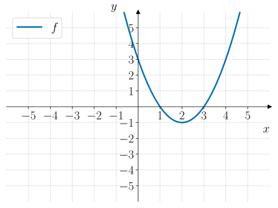
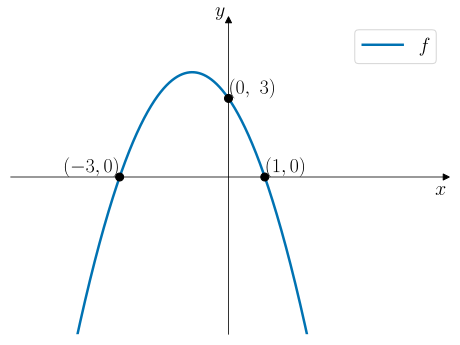
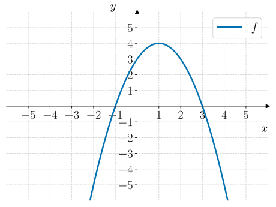
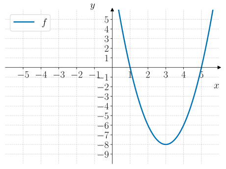
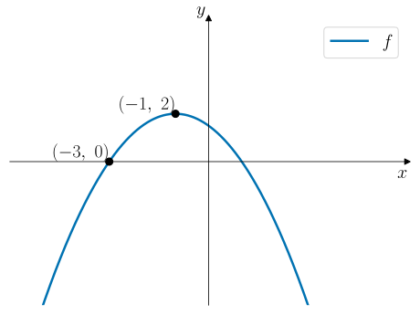
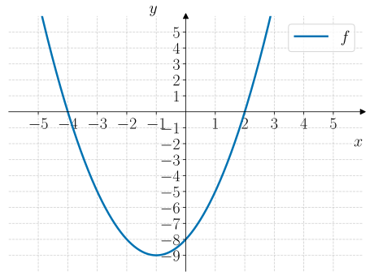
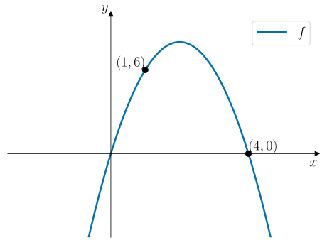

# Andregradsfunksjoner: Representasjoner

:::::::::::::::{exercise} Jeopardy 1
Velg et lagnavn og spill Jeopardy. Samle så mange poeng som mulig!

:::{jeopardy}
Category: Standardform
100: 
    Q: Er grafen til $f(x) = -2x^2 + 4x - 1$ konveks eller konkav?
    A: Konkav siden $a \lt 0$.

200:
    Q: I hvilket punkt skjærer grafen til $f(x) = 2x^2 - 4x + 1$ gjennom $y$-aksen?
    A: $$(0, 1)$$

300:
    Q: Bestem symmetrilinja til $f(x) = -3x^2 + 6x - 2$.
    A: $$x = 1$$

400: 
    Q: Bestem $f(x)$ på standardform for grafen vist nedenfor: 
    A: $$f(x) = x^2 - 4x + 3$$

500: 
    Q: Bestem $f(x)$ på standardform for grafen vist nedenfor: 
    A: $$f(x) = -x^2 - 2x + 2$$

Category: Ekstremalpunktsform
100:
    Q: Bestem koordinatene til ekstremalpunktet til funksjonen $f(x) = -2(x - 3)^2 + 5$?
    A: $$(3, 5)$$

200:
    Q: Bestem koordinatene til ekstremalpunktet til $f(x) = 4(x + 1)^2 - 2$?
    A: $$(-1, -2)$$

300:
    Q: Bestem $f(x)$ på ekstremalpunktsform for grafen vist nedenfor: 
    A: $$f(x) = -(x - 1)^2 + 4$$

400:
    Q: Bestem $f(x)$ på ekstremalpunktsform for grafen vist nedenfor: 
    A: $$f(x) = 2(x - 3)^2 - 8$$

500:
    Q: Bestem $f(x)$ på ekstremalpunktsform for grafen vist nedenfor: 
    A: $$f(x) = -\dfrac{1}{2}(x + 1)^2 + 2$$

Category: Nullpunktsform
100:
    Q: Bestem nullpunktene til $f(x) = -2(x + 1)(x - 4)$.
    A: $x = -1$ og $x = 4$

200:
    Q: I hvilke punkter skjærer grafen til $f(x) = (x - 2)(x + 3)$ gjennom $x$-aksen?
    A: $x = -3$ og $x = 2$.

300:
    Q: Bestem symmetrilinja til $f(x) = 3(x - 1)(x + 5)$.
    A: $$x = -2$$

400: 
    Q: Bestem $f(x)$ på nullpunktsform for grafen vist nedenfor: 
    A: $$f(x) = (x - 2)(x + 4)$$

500:
    Q: Bestem $f(x)$ på nullpunktsform for grafen vist nedenfor: 
    A: $$f(x) = -2x(x - 4)$$

Category: Kvadratsetninger
100:
    Q: Faktoriser uttrykket $x^2 + 6x + 9$.
    A: $$(x + 3)^2$$

200:
    Q: Utvid uttrykket $(x - 4)^2$.
    A: $$x^2 - 8x + 16$$

300:
    Q: Faktoriser uttrykket $4x^2 - 12x + 9$
    A: $$(2x - 3)^2$$

400:
    Q: Faktoriser $(x - 3)^2 - 4$.
    A: $$(x - 5)(x - 1)$$

500:
    Q: Faktoriser $-(x + 1)^2 + 9$.
    A: $$-(x + 4)(x - 2)$$

:::

:::::::::::::::

