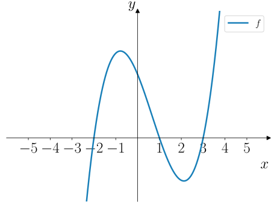
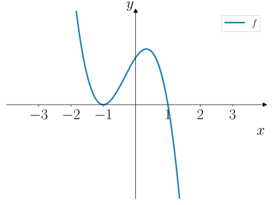
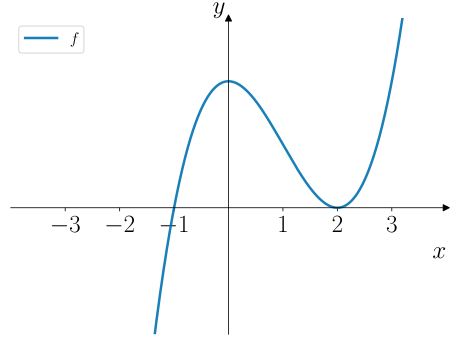
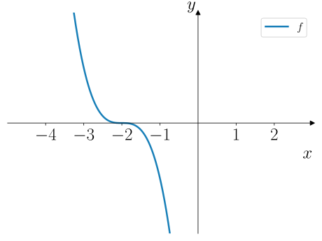
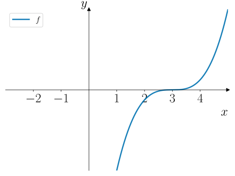

# Polynomfunksjoner

:::{admonition} Læringsmål
---
class: tip
---
* Kunne bestemme nullpunktene til polynomfunksjoner grafisk eller ved hjelp av nullpunktsformen.
* Kunne tegne fortegnslinjer for en polynomfunksjon og skissere grafen.
* Kunne bestemme $f(x)$ for polynomfunksjoner. 
:::

Vi har allerede møtt på to polynomfunksjoner – lineære funksjoner og andregradsfunksjoner. Nå skal vi gå løs på helt generelle polynomfunksjoner. Fiksa med {poly-icon}`cubicup` og {poly-icon}`cubicdown`. For andregradsfunksjoner har vi {poly-icon}`smile` og {poly-icon}`frown`.

:::::{admonition} Definisjon: Polynomfunksjon
---
class: theory
---
Et **polynom** $f(x)$ er en sum av ledd på formen $a_n x^n$ der $a_n$ er koeffisienten til leddet og $n \in \{0, 1, 2, \ldots\}$ 

Den største verdien av $n$ i summen kalles for **graden** til polynomet.

En **polynomfunksjon** $f$ er en funksjon der $f(x)$ er et polynom. 

:::::

> Vi skal ikke gjøre et stort poeng ut av forskjellen på et polynom og en polynomfunksjon. 

:::::::::::::::{admonition} Eksempel 1
---
class: example
---
Under vises eksempler på polynomer med ulik grad.
::::::::::::::{tab-set}
:::::::::::::{tab-item} Grad 1

$$
f(x) = 2x + 3
$$

:::{figure} ./figurer/eksempler/eksempel_1/grad_1.svg
---
width: 80%
class: no-click, adaptive-figure
---
:::

:::::::::::::

:::::::::::::{tab-item} Grad 2

$$
f(x) = x^2 - 2x - 3
$$

:::{figure} ./figurer/eksempler/eksempel_1/grad_2.svg
---
width: 80%
class: no-click, adaptive-figure
---
:::

:::::::::::::

:::::::::::::{tab-item} Grad 3

$$
f(x) = x^3 - 2x^2 - x + 2
$$

:::{figure} ./figurer/eksempler/eksempel_1/grad_3.svg
---
width: 80%
class: no-click, adaptive-figure
---
:::

:::::::::::::

:::::::::::::{tab-item} Grad 4

$$
f(x) = x^4 + 3x^3 - x^2 - 3x + 4
$$

:::{figure} ./figurer/eksempler/eksempel_1/grad_4.svg
---
width: 80%
class: no-click, adaptive-figure
---
:::

:::::::::::::

::::::::::::::

:::::::::::::::

## Tredjegradspolynomer

Tredjegradspolynomer vil fungere som en "lekemodell" for alle polynomfunksjoner av høyere grad. Alle teknikkene vi anvender på tredjegradspolynomer vil også fungere på polynomer av høyere grad.

:::{admonition} Tredjegradsfunksjoner
---
class: theory
---
En **tredjegradsfunksjon** $f$ er en funksjon der $f(x)$ er et tredjegradspolynom. Vi kan generelt skrive 

$$
f(x) = ax^3 + bx^2 + cx + d,
$$

der $a, b, c, d \in \mathbb{R}$ er koeffisientene til polynomet. 
:::

Men det krever en del arbeid før vi vil være i stand til å drøfte dem fullstendig når de er skrevet på denne formen. Derfor skal vi starte med noen enklere tilfeller. 

:::::::::::::::{admonition} Utforsk 1
---
class: explore
---
En tredjegradsfunksjon kan skrives på formen 

$$
f(x) = a(x - x_1)(x - x_2)(x - x_3),
$$

der $x_1$, $x_2$ og $x_3$ er nullpunktene til funksjonen – men må ikke nødvendigvis være forskjellige.

> Husk at det er mulig å zoome inn og flytte rundt på grafikkvinduene under.
::::::::::::::{tab-set}
---
class: tabs-parts
---
:::::::::::::{tab-item} a

Under kan du justere verdien til $a$, mens nullpunktene $x_1$, $x_2$ og $x_3$ er fastholdt.

Undersøk hvordan $a$ påvirker formen på grafen til $f$. Forklar spesielt hva som skjer når $a$ er positiv og negativ.

:::{raw} html
---
file: ./ggb/utforsk/utforsk_1/a.html
---
:::

:::::::::::::

:::::::::::::{tab-item} b
Under kan du justere verdien til $x_1$, mens $a$, $x_2$ og $x_3$ er fastholdt. 

1. Hva bestemmer verdien til $x_1$?
2. Hva skjer hvis du setter $x_1 = x_2$ eller $x_1 = x_3$?

:::{raw} html
---
file: ./ggb/utforsk/utforsk_1/b.html
---
:::

:::::::::::::

:::::::::::::{tab-item} c

Undersøk hva som skjer hvis $x_1 = x_2 = x_3$. 

:::{raw} html
---
file: ./ggb/utforsk/utforsk_1/c.html
---
:::

:::::::::::::

::::::::::::::

:::::::::::::::

:::::::::::::::{admonition} Faktorisering av tredjegradspolynomer
---
class: summary
---
Et tredjegradspolynom $f$ kan ha ett, to eller tre nullpunkter. 

::::::::::::::{tab-set}
:::::::::::::{tab-item} Tre nullpunkter
Hvis $f$ har tre nullpunkter, kan vi skrive 

$$
f(x) = a(x - x_1)(x - x_2)(x - x_3),
$$

der $x_1$, $x_2$ og $x_3$ er nullpunktene og $a$ er en konstant.

::::{figure} ./figurer/teori/nullpunkter/tre_nullpunkter.svg
---
width: 80%
class: no-click, adaptive-figure
---
::::

:::::::::::::

:::::::::::::{tab-item} To nullpunkter
Hvis $f$ har to nullpunkter $x_1$ og $x_2$, og nullpunktet $x_1$ også er et ekstremalpunkt, så kan vi skrive 

$$
f(x) = a(x - x_1)^2 (x - x_2),
$$

der $a$ er en konstant. Vi kaller $x_1$ for et **dobbelt nullpunkt**. 

::::{figure} ./figurer/teori/nullpunkter/to_nullpunkter.svg
---
width: 80%
class: no-click, adaptive-figure
---
::::

:::::::::::::

:::::::::::::{tab-item} Ett nullpunkt
Hvis $f$ har **ett** nullpunkt $x_1$ og en tangent gjennom nullpunktet har stigningstall $0$, så kan vi skrive 

$$
f(x) = a(x - x_1)^3,
$$

der $a$ er en konstant.

::::{figure} ./figurer/teori/nullpunkter/ett_nullpunkt.svg
---
width: 80%
class: no-click, adaptive-figure
---
::::

:::::::::::::

::::::::::::::

:::::::::::::::

---

:::::::::::::::{exercise} Quiz 1

:::{quiz}
Q: Hvilket funksjonsuttrykk passer med grafen? 
+ $$f(x) = (x - 1)(x + 2)(x - 3)$$
- $$f(x) = (x - 1)^2(x - 3)$$
- $$f(x) = (x + 2)(x - 3)^2$$
- $$f(x) = -(x - 1)(x + 2)(x - 3)$$

Q: Hvilket funksjonsuttrykk passer med grafen? 
+ $$f(x) = -(x + 1)^2(x - 1)$$
- $$f(x) = -(x + 1)(x - 1)^2$$
- $$f(x) = (x - 1)^3$$
- $$f(x) = (x + 1)^2(x - 1)$$

Q: Hvilket funksjonsuttrykk passer med grafen? 
+ $$f(x) = (x + 1)(x - 2)^2$$
- $$f(x) = -2(x + 1)(x - 2)^2$$
- $$f(x) = (x + 1)^2(x - 2)$$
- $$f(x) = -(x + 1)^2(x - 2)$$

Q: Vilket funksjonsuttrykk passer med grafen? 
+ $$f(x) = -(x + 2)^3$$
- $$f(x) = (x - 2)^2(x + 2)$$
- $$f(x) = (x + 2)^3$$
- $$f(x) = -(x - 2)^3$$

Q: Hvilket funksjonsuttrykk passer med grafen? 
+ $$f(x) = (x - 3)^3$$
- $$f(x) = (x + 3)^3$$
- $$f(x) = -(x - 3)^3$$
- $$f(x) = -(x + 3)^3$$

:::

:::::::::::::::

---

:::::::::::::::{admonition} Utforsk 2
---
class: explore
---
Et tredjegradspolynom er gitt ved 

$$
f(x) = (x - 1)^2 (x + 2). 
$$

::::::::::::::{tab-set}
---
class: tabs-parts
---
:::::::::::::{tab-item} a
Utvid uttrykket til $f(x)$ og skriv det på formen 

$$
f(x) = ax^3 + bx^2 + cx + d. 
$$

::::{admonition} Fasit
---
class: answer, dropdown
---
$$
f(x) = x^3 - 3x + 2.
$$

::::

::::{admonition} Løsning
---
class: solution, dropdown
---
\begin{align*}
    f(x) &= (x - 1)^2 (x + 2) \\
    \\
    &= (x^2 - 2x + 1)(x + 2) && \text{utvidet $(x - 1)^2$ først}\\
    \\
    &= (x^2 - 2x + 1)\cdot x + (x^2 - 2x + 1)\cdot 2 \\
    \\
    &= x^3 - 2x^2 + x + 2x^2 - 4x + 2 \\
    \\
    &= x^3 - 3x + 2.
\end{align*}

::::

:::::::::::::

:::::::::::::{tab-item} b
Bestem nullpunktene til $f$. 

> Bruk det faktoriserte uttrykket og produktregelen for likninger! 

::::{admonition} Fasit
---
class: answer, dropdown
---

$$
x = 1 \or x = -2
$$

::::

::::{admonition} Løsning
---
class: solution, dropdown
---
Nullpunktene er gitt ved løsningen av $f(x) = 0$, som betyr at 

$$
(x - 1)^2 \cdot (x + 2) = 0 \liff (x - 1)^2 = 0 \or x + 2 = 0.
$$

som gir 

$$
x - 1 = 0 \or x + 2 = 0 \liff x = 1 \or x = -2.
$$
::::

:::::::::::::

:::::::::::::{tab-item} c
Tegn et fortegnsskjema for $f(x)$ (som inkluderer fortegnslinjene til faktorene i $f(x)$).

> Bruk det faktoriserte uttrykket! 

::::{admonition} Fasit
---
class: answer, dropdown
---

:::{figure} ./figurer/utforsk/utforsk_1/c.svg
---
class: no-click, adaptive-figure
width: 100%
---
:::

::::

:::::::::::::

:::::::::::::{tab-item} d
Lag en **skisse** av grafen til $f$.

> Marker nullpunktene og bruk fortegnslinja til $f(x)$ for å tegne skissen!

::::{admonition} Fasit
---
class: answer, dropdown
---

:::{figure} ./figurer/utforsk/utforsk_1/d.svg
---
class: no-click, adaptive-figure
width: 80%
---
:::

::::

:::::::::::::

::::::::::::::

:::::::::::::::

### Bestemme $f(x)$

:::::::::::::::{admonition} Eksempel 2
---
class: example
---

Grafen til et tredjegradspolynom er vist i {numref}`fig-polynomer-nullpunktsform-eksempel-2`.

Bestem $f(x)$.

:::{figure} ./figurer/eksempler/eksempel_2/graf.svg
---
name: fig-polynomer-nullpunktsform-eksempel-2
width: 80%
class: no-click, adaptive-figure
---
viser grafen til et tredjegradspolynom.
:::

::::{admonition} Løsning
---
class: solution
---
Fra grafen vi kan vi lese av to nullpunkter $x = -3$ og $x = 1$. Vi kan også bemerke oss at $x = -3$ er et ekstremalpunkt, som betyr at dette er et dobbelt nullpunkt. Dermed er

$$
f(x) = a(x + 3)^2 (x - 1). 
$$

For å bestemme $a$ finner vi ett punkt til på grafen. Vi kan lese av at grafen går gjennom $(0, -3)$ som betyr at 

$$
f(0) = -3 \and f(0) = a\cdot (0 + 3)^2 \cdot (0 - 1) = -9a
$$

Dermed er 

$$
-9a = -3 \liff a = \dfrac{1}{3}.
$$

Altså er 

$$
f(x) = \dfrac{1}{3}(x + 3)^2 (x - 1).
$$

::::

:::::::::::::::

---

:::::::::::::::{admonition} Underveisoppgave 1
---
class: check
---
Grafen til en tredjegradsfunksjon $f$ er vist i {numref}`fig-polynomer-polynomfunksjoner-underveisoppgave-1`.

Bestem $f(x)$. 

:::{figure} ./figurer/underveisoppgaver/underveisoppgave_1/graf.svg
---
name: fig-polynomer-polynomfunksjoner-underveisoppgave-1
width: 80%
class: no-click, adaptive-figure
---
viser grafen til en tredjegradsfunksjon $f$. 
:::

::::{admonition} Fasit
---
class: answer, dropdown
---

$$
f(x) = -(x + 1)(x - 1)(x - 2)
$$

::::

::::{admonition} Løsning
---
class: solution, dropdown
---
Grafen til $f$ har nullpunktene

$$
x = -1 \or x = 1 \or x = 2,
$$

som betyr at vi kan skrive $f(x)$ som 

$$
f(x) = a(x + 1)(x - 1)(x - 2).
$$

For å bestemme $a$ finner vi ett punkt til på grafen. Grafen går gjennom $(0, -2)$ som betyr at 

$$
f(0) = -2 \and f(0) = a\cdot (0 + 1)(0 - 1)(0 - 2) = 2a
$$

Dermed er 

$$
2a = -2 \liff a = -1.
$$

Altså er $f(x)$ gitt ved 

$$
f(x) = -(x + 1)(x - 1)(x - 2).
$$
::::

:::::::::::::::

Vi tar et eksempel på hvordan vi kan gå frem for å bestemme $f(x)$ gitt grafen til et tredjegradspolynom. Den algebraiske regningen vil være såpass fiklete, at her skal vi benytte oss av CAS for å bestemme $f(x)$.  

:::::::::::::::{admonition} Utforsk 3
---
class: explore
---

Grafen til en tredjegradsfunksjon $f$ er vist i {numref}`fig-polynomer-nullpunktsform-utforsk-3`.

:::{figure} ./figurer/utforsk/utforsk_3/graf.svg
---
name: fig-polynomer-nullpunktsform-utforsk-3
width: 80%
class: no-click, adaptive-figure
---
viser grafen til en tredjegradsfunksjon $f$. Noen punkter på grafen til $f$ er markert i figuren.
:::

Fra grafen kan vi sette opp et likningssystem for $f(x)$ ved å bruke punktene som er markert i figuren:

\begin{align*}
    f(-2) &= 3 && \text{punktet (-2, 3)} \\
    \\
    f(-1) &= 0 && \text{punktet (-1, 0)}\\
    \\
    f(0) &= 3 && \text{punktet (0, 3)}\\
    \\
    f(1) &= 3 && \text{punktet (1, 3)}\\
\end{align*}

> Bruk CAS-vinduet nedenfor til å bestemme $f(x)$. Du må sette opp resten av likningene og løse likningssystemet.

:::{ggb} 720 600
---
material_id: gjefn7be
toolbar: "true"
---
:::

::::{solution}
:::{figure} ./figurer/utforsk/utforsk_3/sol.png
---
width: 100%
class: no-click, adaptive-figure
---
:::

$$
f(x) = -\dfrac{3}{2}x^3 - \dfrac{3}{2}x^2 + 3x + 3.
$$
::::

:::::::::::::::

---

:::::::::::::::{admonition} Underveisoppgave 2
---
class: check
---
Grafen til en tredjegradsfunksjon $f$ er vist i {numref}`fig-polynomer-nullpunktsform-underveisoppgave-2`.

:::{figure} ./figurer/underveisoppgaver/underveisoppgave_2/underveisoppgave_2.svg
---
name: fig-polynomer-nullpunktsform-underveisoppgave-2
width: 80%
class: no-click, adaptive-figure
---
viser grafen til en tredjegradsfunksjon $f$.
:::

::::::::::::::{tab-set}
---
class: tabs-parts
---
:::::::::::::{tab-item} a
Sett opp et likningssystem for $f(x)$ ved å finne fire punkter på grafen til $f$.

:::{admonition} Fasit
---
class: dropdown, answer
---
Grafen går gjennom punktene 

$$
(-1, 0) \and (0, 3) \and (1, 2) \and (2, 3), 
$$

som gir likningssystemet

$$
f(-1) = 0 \and f(0) = 3 \and f(1) = 2 \and f(2) = 3.
$$
:::

:::::::::::::

:::::::::::::{tab-item} b
Løs likningssystemet ved hjelp av CAS og bestem $f(x)$.

:::{cas-popup} 420 500
:::

::::{answer}

Løsningen er

$$
a = 1 \and b = -2 \and c = 0 \and d = 3,
$$

som gir 

$$
f(x) = x^3 - 2x^2 + 3.
$$
::::

::::{solution}

:::{figure} ./figurer/underveisoppgaver/underveisoppgave_2/sol.png
---
width: 80%
class: no-click, adaptive-figure
---
:::

som betyr at 

$$
a = 1 \and b = -2 \and c = 0 \and d = 3.
$$

Dermed er 

$$
f(x) = x^3 - 2x^2 + 3.
$$

::::

:::::::::::::

::::::::::::::

:::::::::::::::
